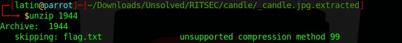

<h1></h1>
--------------------------------------------------------------------- 
Challenge Name : Burn the Candle on Both Ends 
--------------------------------------------------------------------- 

Since it's a forensics challenge i looked up the file format with file and binwalk commands.Binwalk says that there is a 
zip file at offset 0x1944 including flag.txt withinside.Again with binwalk i extracted file contents. 
 
Then i tried unzip the file.Wait what "unsupported compression method 99"??? 
 
As long as google be my friend i leearned : 
<q>Compression method 99 error indicates the AES (Adavance Encryption Standard) encryption. Unfortunately, This encryption standard is currently not supported by unzip binary. However, 7zip package can be used to extract such files. 7zip is available in EPEL project to extract winzip password protected file.</q> 
This means we need 7z package for unzip it. 
Before we crack it let's fire up the johntheripper with rockyou for the zip file. 
 
And john says the password is stegosaurus.So i used another linux tool called 7z with that password. 
 
