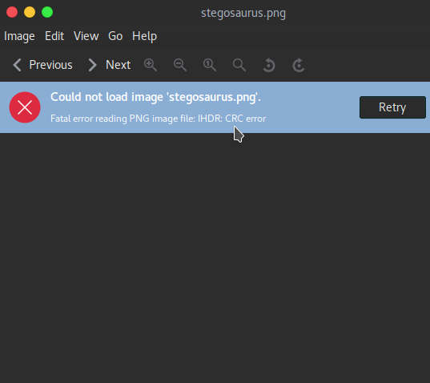
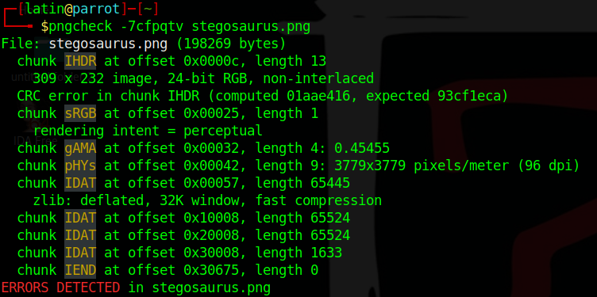
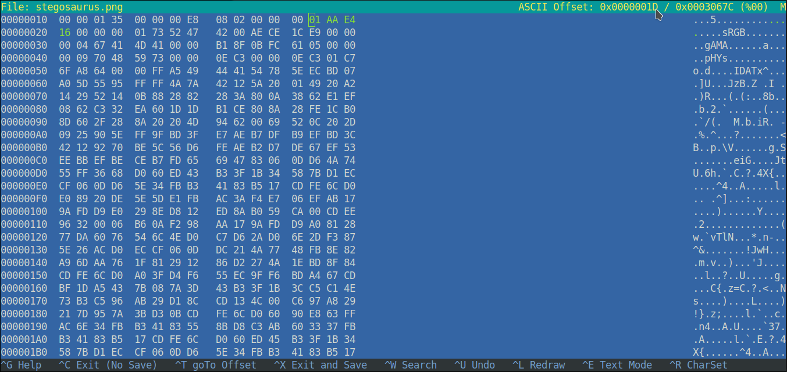
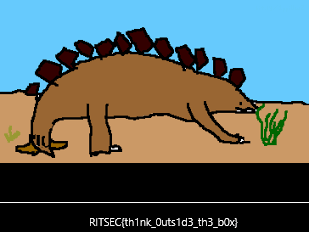

In that challenge we provided by a png file.When we try to open that image we get an error.
 
Image Viewer already pointed out the error.But i wanna get more details about it for that i used the pngcheck tool.
 
And the tool gives the hex bytes in addition to that.So what is the CRC error?  
<q>CRC (Cyclic Redundancy Check) is an error-detecting code commonly used in digital networks and storage devices to detect accidental changes to raw data.</q>,says Wikipedia. 
This means there are changed bytes in my image.So i fired up hexeditor.

Searched the given bytes and replaced them with "01 AA E4 16" at between 0x0000001D and 0x00000020.  

