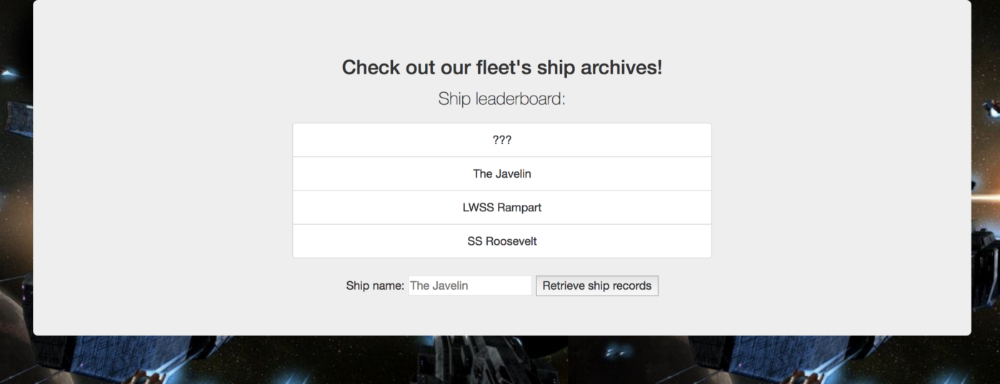

For this challenge we were given a link:<a href="http://fun.ritsec.club:8005/">http://fun.ritsec.club:8005/</a>
When we visit the site we see there is ship archive of the fleet's.
 
When i see the archive keyword the first thing i did was the testing for sql injection.So i added ' after wrote the "The Javelin' and posted it.
"Something went wrong with your record query! What are you trying to do???" was the respond of the server to my query.So my sixth sense was right.A simple payload like the below gave the flag.
 

