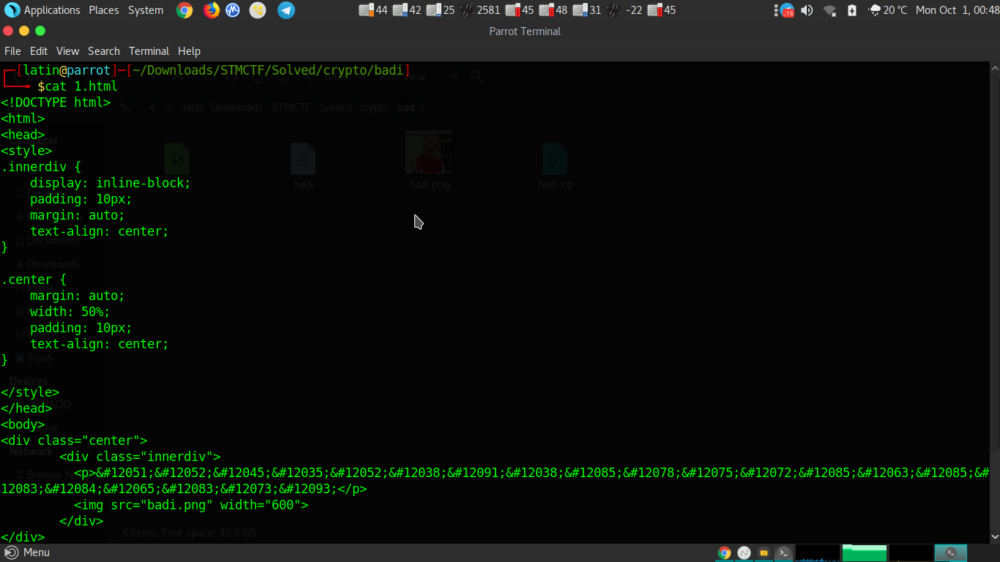

There was a page called "1.html" and a PNG image called "badi".First things first i used cat command for html document.

Like you see there was a encrypted message in the innerdiv class:
<code>&#12051;&#12052;&#12045;&#12035;&#12052;&#12038;&#12091;&#12038;&#12085;&#12078;&#12075;&#12072;&#12085;&#12063;&#12085;&#12083;&#12084;&#12065;&#12083;&#12073;&#12093;</code>
When i see the "&#" i thought message was encoded by its html codes.But there was some issues.Cause when we decode that like we have we get:
34%....
So we need to change somethings.First i looked up the relationship between numbers.All starts with "&#",ends with ";".As long as our flag starts with "STMCTF{" the first two's should be a "ST" and 2nd one is 1 more than 1st one same as the html values of "S"(&#83;) and "T"(&#84;).It should be a substituted relation.So i deleted all the 120's.Then add all the values 32.Decode it and get the flag.Here is the small script for all of that:

