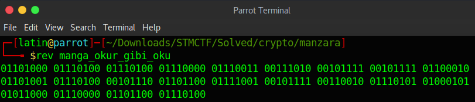
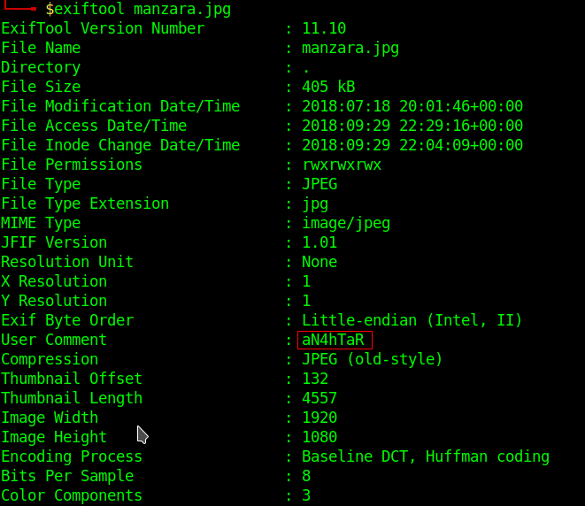
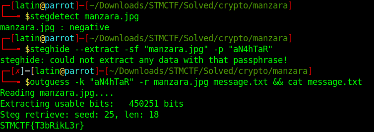

In that challenge there was no file.Just a binary text in the description field:
00101110 00110110 00001110 00011010 10100010 10101110 01001100 11110100 10011110 00110110 01110100 00101110 10010110 01000110 11110100 11110100 01011100 11001110 00001110 00101110 00101110 00010110
When i decoded it directly i get no results.So i reversed the numbers with the rev command.

When we decode it we get a link:
"http://s3.dosya.tc/server16/xngtvv/manzara.zip.html"
The zip file was containing an image called "manzara.jpg".I looked up the metadatas of image first.
.
And there was a user comment: "aN4hTaR" 
Since it was a crypto challenge it ought to be a steganographic image and the comment ought to be the passphrase of it.Usually i use stegdetect and steghide for cases like that.For some reason this time those tools were failed me.I used outguess as an alternative and i get the flag.

