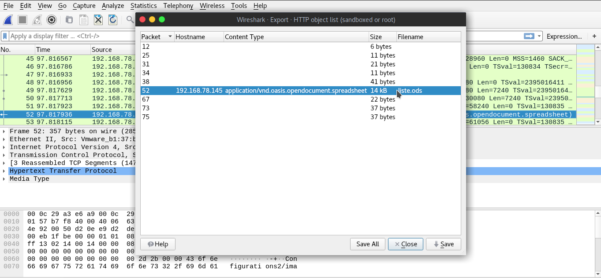
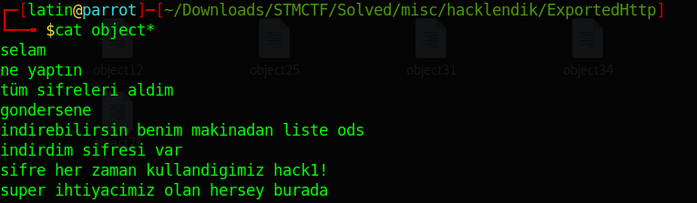
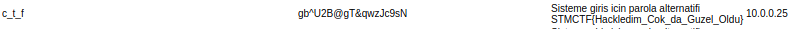

There was a attached pcap file in that challenge.Always the first thing when i investigating a pcap is to looking what objects are exported.And when i looked them there was a conversation and a list.

So i looked all the objects except "liste.ods" by "cat" command.Cause i already know that its a OpenDocument Spreadsheet file.So the cat won't work for that.

"Cat" showed me the conversation that includes the password of "liste.ods".The password was "hack1!" for the spreadsheet.I opened the Spreadsheet with that password.There was a table looks and seems terrible in a both way.To view the table better i exported it as a html file.And the flag was there.

