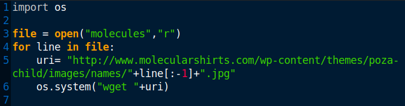
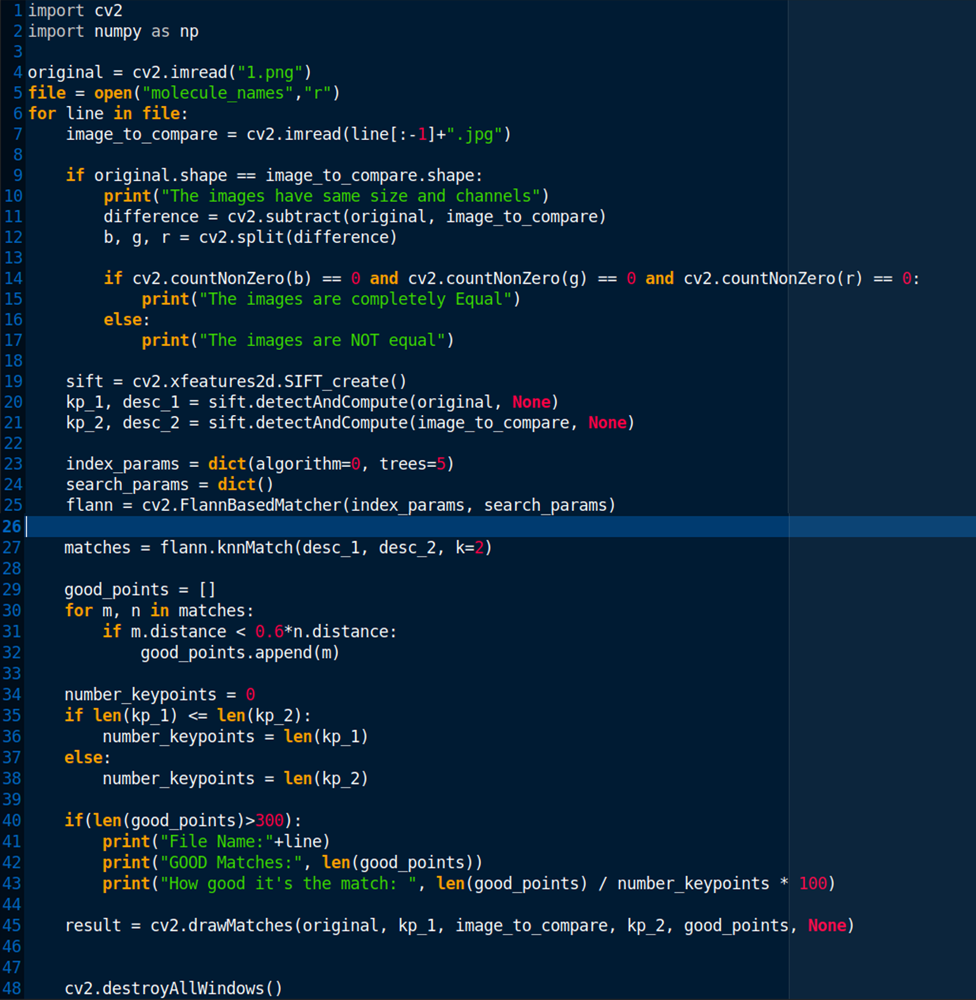
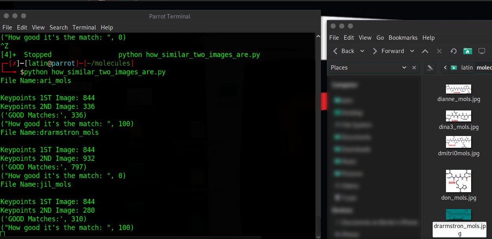
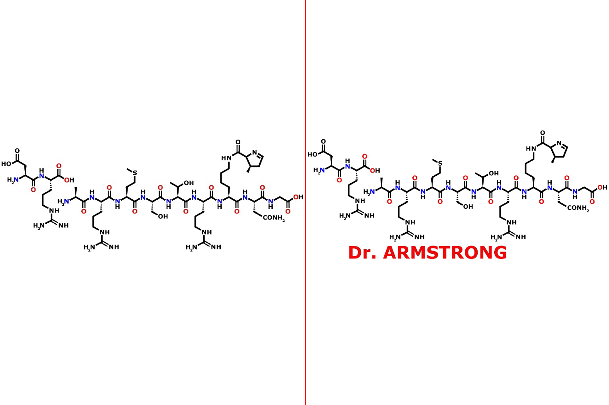

By searching the given image in Yandex gives us the similar photos could be found in the "molecularshirts.com"

To find the picture we provided i decided to download all the photos in the site.I automated the process by using this script.
 
When the script running on another terminal i used this script to compare photos with the provided image.
 
 
Then Voila!
 

