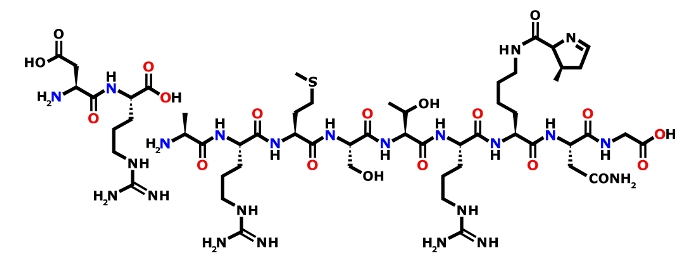
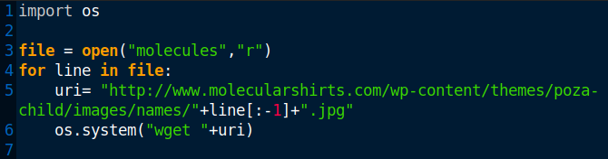
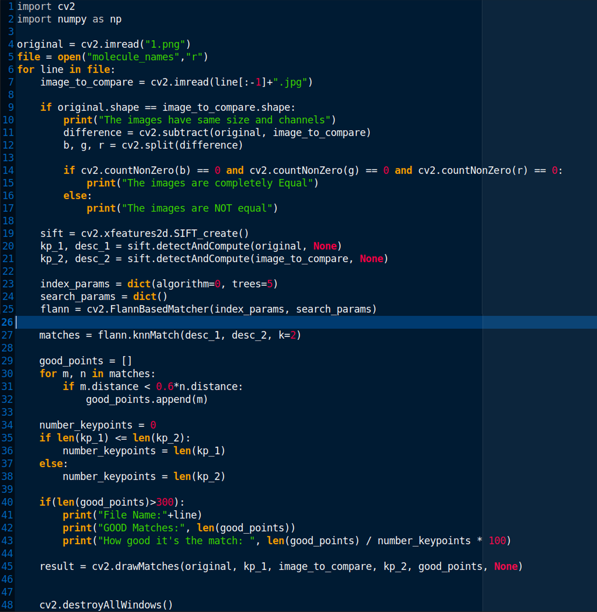
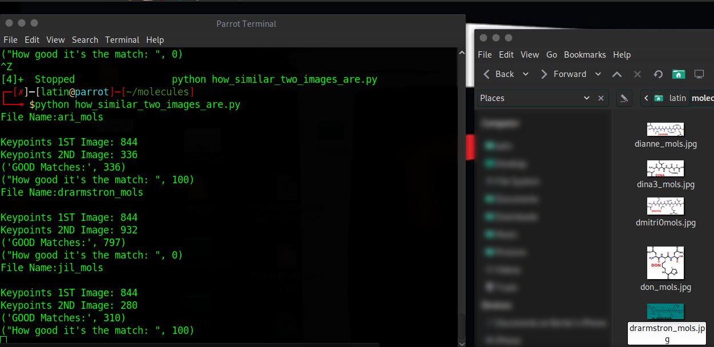
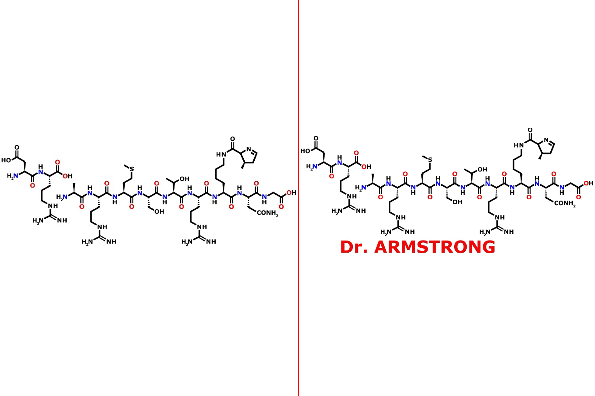

By searching the given image in Yandex gives us the similar photos could be found in the "molecularshirts.com"
 
To find the picture we provided i decided to download all the photos in the site.I automated the process by using this <a href="https://github.com/berkeakil/CTF-Writeups/blob/master/2019/RedPwn/Forensics/Molecule%20Shirts/wget.py">script</a>.
  
When the script running on another terminal i used this <a href="https://github.com/berkeakil/CTF-Writeups/blob/master/2019/RedPwn/Forensics/Molecule%20Shirts/compare.py">script</a> to compare photos with the provided image.
 
 
Then Voila!
 

